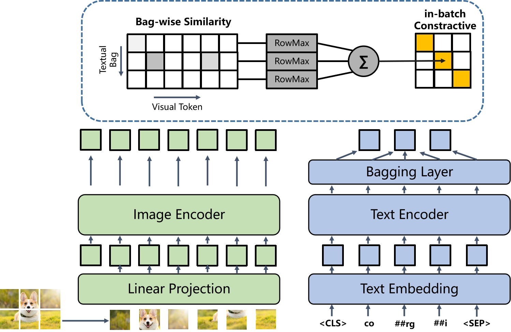

# BagFormer: Better Cross-Modal Retrieval via bag-wise interaction



This is the PyTorch code of the <a href="https://arxiv.org/abs/2212.14322">BagFormer paper</a>. The code has been tested on Python 3.8 and PyTorch 1.13.
To install the dependencies, please create a virtual environment and run 
<pre/>pip install -r requirements.txt</pre> 

### Pre-trained checkpoints:
num of image-text pairs | BagFormer
:---: | :---:  
108M | <a href="https://drive.google.com/file/d/1z4CFDsCza-7FSb60WvXcyepfCaAUuNp3/view?usp=sharing">Download</a>

### Finetuned checkpoints:
Task | BagFormer 
:---: | :---: 
Image-Text Retrieval (MUGE) | <a href="https://drive.google.com/file/d/1Fwy67KA0VYyXBvcAut97iH9vxbzfuNLE/view?usp=share_link">Download</a>

### Image-Text Retrieval:
1. Download MUGE Multimodal Retrieval dataset from the original <a herf="https://tianchi.aliyun.com/dataset/107332">website</a>, and unzip file to data directory, or modify the path in configs/config_muge.yaml.
2. To evaluate the finetuned BagFormer model on MUGE, run:
<pre>python3 train_muge.py \
--checkpoint path-to-checkpoint \
--interaction bagwise \
--output_dir path-to-output \
--evaluate</pre> 

3. To finetune the pre-trained checkpoint. Then run:
<pre>python3 train_muge.py \
--checkpoint path-to-checkpoint \
--interaction bagwise \
--output_dir path-to-output </pre> 

### Calculate bag-wise similarity
```python
import torch
import torch.nn.functional as F
from PIL import Image
from ruamel import yaml
from transformers import BertTokenizer

from models.loss import tokenwise_similarity_martix
from models.model_helper import EmbeddingBagHelperAutomaton
from models.model_retrieval_bagwise import BagFormer
from MUGE_helper.dataset import get_test_transform

device = "cuda" if torch.cuda.is_available() else "cpu"
text_encoder = "bert-base-chinese"
max_seq_len = 25
config = yaml.load(open("configs/config_muge.yaml", "r"), Loader=yaml.Loader)
test_transform = get_test_transform(config)

tokenizer = BertTokenizer.from_pretrained(text_encoder)

model = BagFormer(
    config=config, 
    text_encoder=toext_encoder,
    tokenizer=tokenizer
    )

checkpoint = torch.load(
    "path-to-checkpoint", map_location="cpu"
)
model.load_state_dict(checkpoint["model"], strict=False)
model = model.to(device)

embedding_bag_helper = EmbeddingBagHelperAutomaton(
    tokenizer, config["entity_dict_path"], masked_token=["[CLS]", "[PAD]"]
)

product_image = test_transform(Image.open("rumble_roller.jpeg"))
image = product_image.unsqueeze(0).to(device)

product_title = ["rumble roller", "nike zoomx vista"]
text = tokenizer(product_title, padding="max_length", max_length=max_seq_len)

embed_bag_offset, attn_mask = embedding_bag_helper.process(text, return_mask=True)
embed_bag_offset = torch.LongTensor(embed_bag_offset).to(device)
embed_bag_attn_mask = torch.LongTensor(attn_mask).to(device)
text = text.convert_to_tensors("pt").to(device)

with torch.no_grad():
    # encode image and text
    image_features = model.visual_encoder(image)
    text_features = model.text_encoder(
        text.input_ids, attention_mask=text.attention_mask, mode="text"
    ).last_hidden_state
    # get text bag feature
    batch_size, seq_len, text_width = text_features.shape
    embedding_input = torch.arange(batch_size * seq_len, device=device)
    embedbag_feats = F.embedding_bag(
        embedding_input,
        text_features.view(-1, text_width),
        embed_bag_offset,
        mode="sum",
    ).view(batch_size, -1, text_width)
    embedbag_feats = F.normalize(embedbag_feats, dim=-1)
    # pad to same length
    embedbag_seq_len = embedbag_feats.shape[1]
    embedbag_feats = F.pad(
        embedbag_feats,
        pad=(0, 0, 0, max_seq_len - embedbag_seq_len, 0, 0),
        mode="constant",
        value=0,
    )
    # calc bagwise similarity matrix
    sim_i2t, sim_t2i = tokenwise_similarity_martix(embedbag_feats, image_features)

print("image feature shape:", image_features.shape)  
# prints: torch.Size([1, 257, 768])
print("text feature shape:", embedbag_feats.shape)  
# prints: torch.Size([2, 25, 768])
print("img2text sim:", sim_i2t)  # prints: [[132.4761, 50.0424]
print("text2img sim:", sim_t2i)  # prints: [[33.4206], [19.6727]]
```